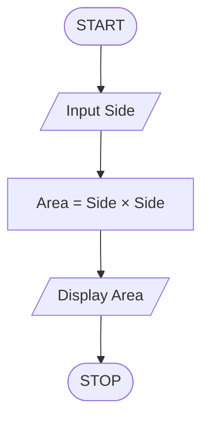
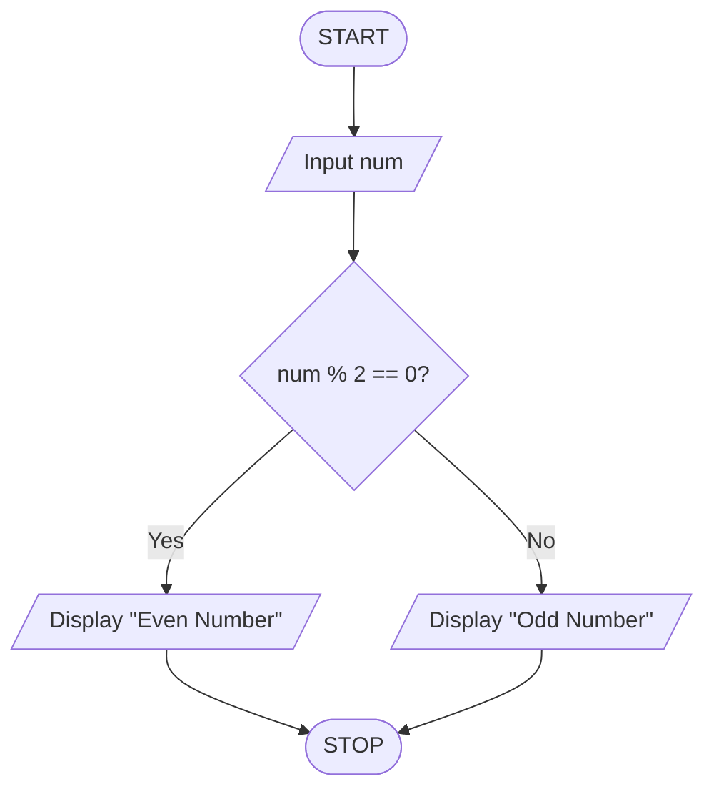
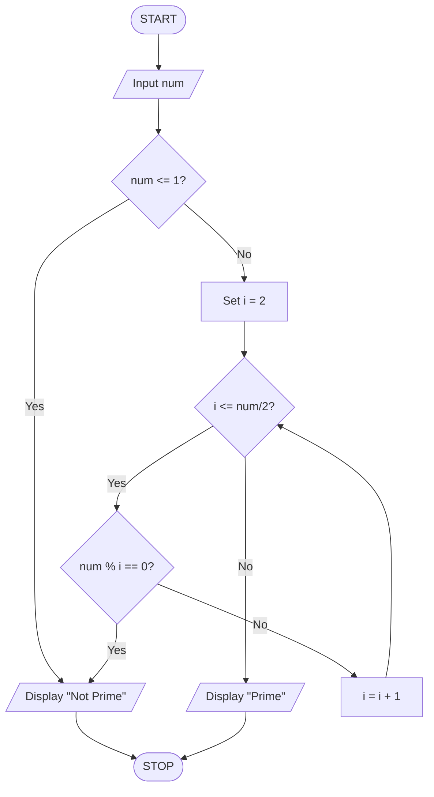

### FLOWCHART        * used for logic building *

**A flowchart is a graphical representation of an algorithm that uses standardized symbols and arrows to show the step-by-step flow of logic for solving a problem.**

## common symbols 
* Oval           -> Start / Stop
* Rectangle      -> Process
* Parallelogram  -> Input / Output
* Diamond        -> Decision
* Arrow          -> Flow Direction

## Example 1 → Area of a Square

Problem : Calculate the area of a square.

## Example 2->
Problem : Is Given Number a Even Number or Odd Number

### PSEUDOCODE

**Pseudocode is a language-independent representation of an algorithm written using structured programming constructs such as sequence, selection, and iteration, without following the syntax of a specific programming language.**

  
## Example 1->
Problem : To check whether the number is Prime or not

****************************************************************